[toc]

# 人事管理系统案例后端开发功能说明书

时间：2020年7月3日13:26:56

大三下学期，东软人事管理springboot项目（后端开发）

后端开发人员：刘DG 童BR

## 注册和登录的时候用md5进行密码加密。

springboot自带MD5加密：

项目中文件路径：com.ndgwww.HR.management.Config.MD5UtilConfig

注册账户：会将密码自动加密后存入数据库：

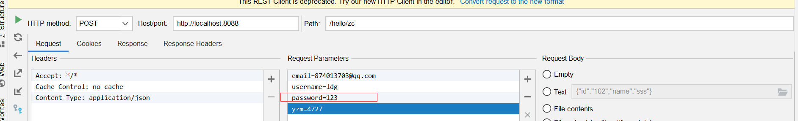


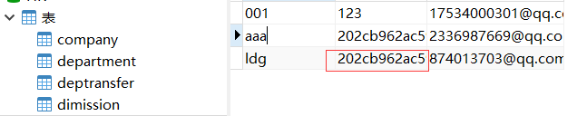

登录用户：会将用户输入的密码加密后后数据库中的进行对比：

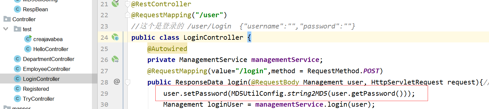

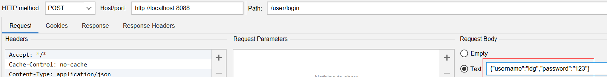


## 登录实现token验证

接着上面的登录：我们在不进行登录时（没有获取到token）是无法访问除了注册界面的其他任何界面的

http://localhost:8088/user/login

{"username":"ldg","password":"123"}

展示：http://localhost:8088/employee/selectAllEmployee

**SpringBoot集成JWT实现token验证**

JWT包含了三部分：

- Header 头部(标题包含了令牌的元数据，并且包含签名和/或加密算法的类型)

- Payload 负载

- Signature 签名/签证

  

类JWTUtil是用来实现（生产）一个tocken的项目路径com.ndgwww.HR.management.util.JWTUtil

在我们登录操作后生成

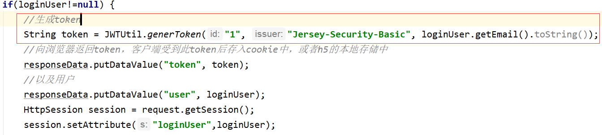


## 项目中拦截器和拦截器的配置

创建拦截器实现HandlerInterceptor接口，token拦截器的项目文件地址：com.ndgwww.HR.management.Config.interceptor.HeaderTokenInterceptor

这里注意：我们将请求头中的token验证字符改为了Authorization

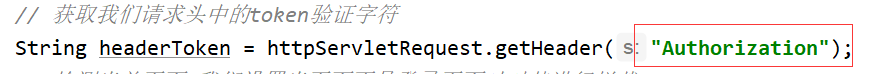

配置拦截器：项目文件地址：com.ndgwww.HR.management.Config.interceptor.MyMvcConfig

设置了跨域和token拦截器的配置

注意：这里将注册路径和静态路径给释放了，

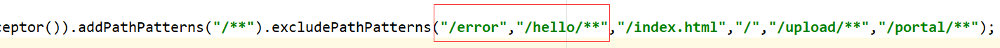

## 项目中关于自定义日期处理器DateFormat

文件路径：com.ndgwww.HR.management.Config.Converter


## 关于部门管理模块

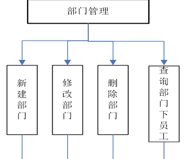

相对来说简单，字段少。这个模块介绍部分内容：

这个模块主要是通过mybatis注解的形式来实现动态sql和一些联查的

mapper项目路径：com.ndgwww.HR.management.mapper.mapper2.UserMapper

1. 这里的删除部门是修改字段type，同时查询也是根据type来查询的
2. 更新部门和新增部门都是通过动态sql来实现任意字段的更新和删除：

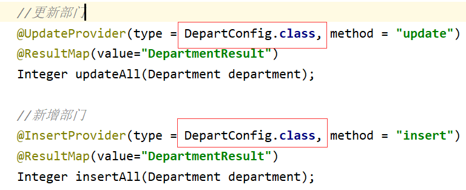

动态sql文件地址com.ndgwww.HR.management.Config.DepartConfig

**值得一提的是：查询每个部门下有多少员工这个查询，我实现了2个方式：**

```
/department/DepartmentcountEmployee
```

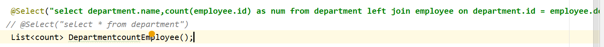

这是一个统计查询：先分组在统计，主要用来实现前端的echarts界面展示

第二种方式主要是对员工表进行管理：


## 关于员工管理模块：

这个模块是用的mybatis的逆向工程生成xml配置文件来实现动态sql，多表联查等等


查询部门下的所有员工：/employee/selectDepartIdEmployee


## 批量删除员工（实现多选删除）

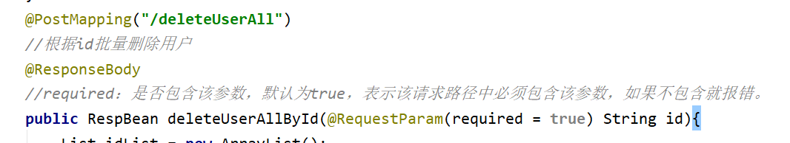

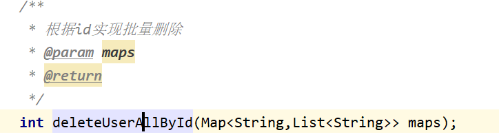

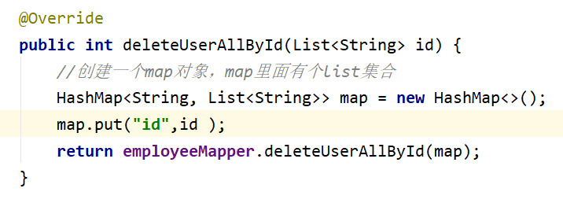


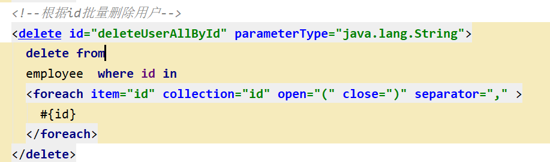

### 分页查询所有员工信息

```
http://localhost:8088/employee/selectAllEmployee
```

MyBatis分页插件－PageHelper

[相关参数](https://blog.csdn.net/yibi4700/article/details/77411438?utm_medium=distribute.pc_relevant.none-task-blog-BlogCommendFromMachineLearnPai2-1.edu_weight&depth_1-utm_source=distribute.pc_relevant.none-task-blog-BlogCommendFromMachineLearnPai2-1.edu_weight)

Content-Type:application/json

Authorization

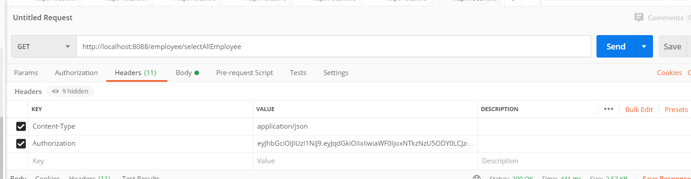

### 员工入职管理 

这里的新增员工更新员工修改员工信息都是用的mybatis动态sql：mapper/EmployeeMapper.xml

这里主要说一下实习期员工管理：

http://localhost:8088/employee/insertSelective

{"id":"100","name":"测试"}

运用了一个触发器他会自动向员工实习表try里面插入对应字段：

## 实习员工管理：

连表查询实习员工信息：员工表和实习信息表连表，在实习表的pojo类中有一个员工表对象

实习员工转正，不通过延期：动态更新语句实现，更新一个字段

注意离职：离职会删除实现表中的员工信息还会在员工表中将这个员工也删除了**多表删除**（毕竟实习员工也是员工。。。）


## 后台全部流程：其他功能童br同学进行实现

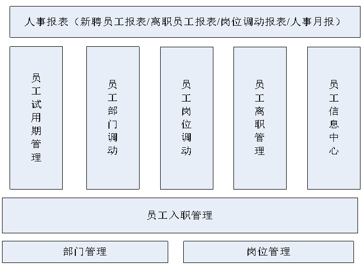

## 关于注册

获取验证码邮箱接口：

```
http://localhost:8088/hello/yz?email=1753400030@qq.com
 
Get请求，需要参数email
 
带参数email参数数据库查询，邮箱是否被注册，返回值：邮箱已被注册或注册码已发送该邮箱，并完成发送注册码的操作，并将注册码保存，已被后续与用户输入的注册码进行比较。
```

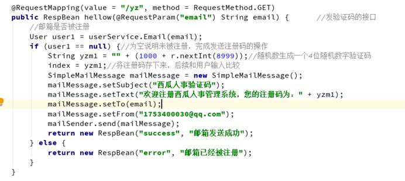

 

Springboot email配置和依赖

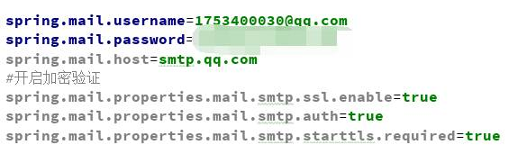

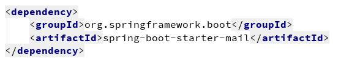

### 注册的接口：

```
http://localhost:8088/hello/zc
```

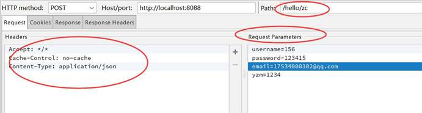

 

注册时，首先检查注册码，用户输入的是否和之前存储的一致，返回验证码错误。

正确继续进行username用户名数据库查询，是否已经被占用，进而进行存储用户数据。

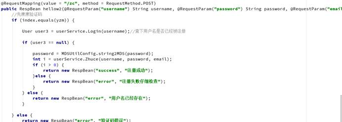

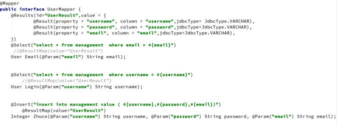

### 关于部门

和刘DG同学协作完成。我完成了部分功能，之后再由他负责整合，考虑到修改或增加信息时不会输入完整的信息，后来使用动态sql完成，使用了注解和配置文件实现。

### 关于岗位

实现了岗位的增删改查的操作，在增和改使用了mybatis逆向工程的动态sql。

 

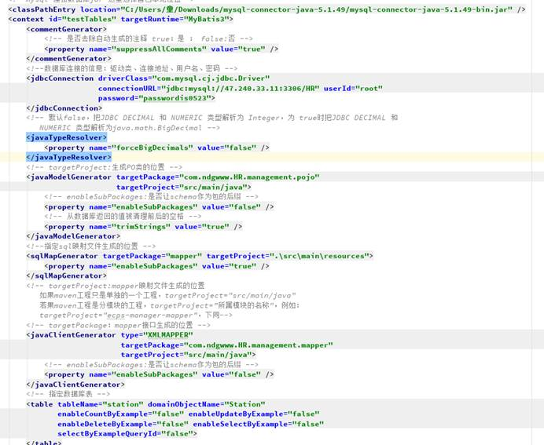

 

|      |                                                         |
| ---- | ------------------------------------------------------- |
|      | 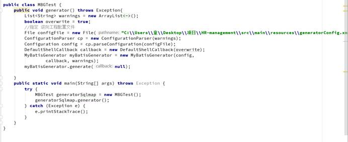 |


 

 

 